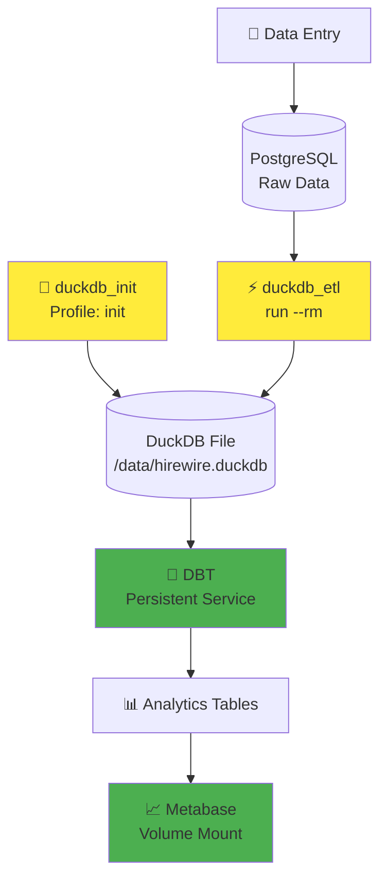

# 🏗️ HireWire Architecture

Architecture optimisée pour une utilisation efficace des conteneurs Docker.

## 🎯 Principe clé

**Le container DuckDB n'a pas besoin de tourner en permanence !** 

Une fois le fichier `/data/hirewire.duckdb` créé, DBT et Metabase peuvent y accéder directement via les volumes partagés.

## 🐳 Services Docker

### 🔄 Services permanents

```bash
docker-compose up postgres dbt metabase
```

- **`postgres`** : Base transactionnelle, toujours active
- **`dbt`** : Service de transformation, garde le container actif pour les commandes
- **`metabase`** : Interface de visualisation

### ⚡ Services ponctuels

```bash
# Initialisation (une seule fois)
docker-compose --profile init up duckdb_init

# ETL (à la demande)
docker-compose run --rm duckdb_etl python3 /scripts/etl/etl_postgres_to_duckdb.py
```

- **`duckdb_init`** : Crée le star schema, puis s'arrête
- **`duckdb_etl`** : Lance l'ETL, puis s'arrête automatiquement

## 📊 Flow de données



## 🗂️ Accès au fichier DuckDB

| Service | Chemin container | Type |
|---------|------------------|------|
| `duckdb_init` | `/data/hirewire.duckdb` | Lecture/Écriture |
| `duckdb_etl` | `/data/hirewire.duckdb` | Lecture/Écriture |
| `dbt` | `/data/hirewire.duckdb` | Lecture uniquement |
| `metabase` | `/duckdb-data/hirewire.duckdb` | Lecture uniquement |

## 🚀 Commandes usuelles

### Démarrage initial
```bash
# Démarrer services permanents
docker-compose up -d postgres dbt metabase

# Initialiser DuckDB (une seule fois)
docker-compose --profile init up duckdb_init
```

### Pipeline ETL
```bash
# Via script organisé
./scripts/main.sh etl run

# Ou directement
docker-compose run --rm duckdb_etl python3 /scripts/etl/etl_postgres_to_duckdb.py
docker-compose exec dbt sh -c "cd /usr/app && dbt run"
```

### Saisie de données
```bash
./scripts/main.sh data-entry manage
```

## ⚖️ Avantages de cette architecture

### ✅ Efficacité ressources
- Pas de containers DuckDB inutiles qui tournent
- Services ponctuels avec `--rm` pour nettoyage auto
- Seuls les services nécessaires restent actifs

### ✅ Séparation claire
- **Init** : Création du star schema (une fois)
- **ETL** : Transformation des données (à la demande)
- **Services** : DBT et Metabase accèdent au fichier directement

### ✅ Flexibilité
- ETL peut tourner indépendamment
- Redémarrage services sans impact sur données
- Profils Docker Compose pour différents usages

## 🔧 Docker Compose Profiles

```bash
# Profil par défaut (services permanents)
docker-compose up

# Profil initialisation
docker-compose --profile init up duckdb_init

# Service ETL ponctuel
docker-compose run --rm duckdb_etl [command]
```

## 📈 Monitoring

```bash
# Vérifier les tables DuckDB
./scripts/main.sh testing test

# Statut des services
docker-compose ps

# Logs DBT
docker-compose logs dbt

# Logs Metabase
docker-compose logs metabase
```

Cette architecture optimise l'usage des ressources tout en gardant la flexibilité pour les opérations de données.