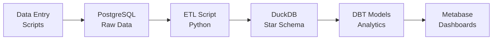

# HireWire Scripts

Scripts organisés par catégorie pour une meilleure maintenabilité.

## 🚀 Utilisation rapide

```bash
# Script principal - point d'entrée unique
./scripts/main.sh help

# Exemples d'utilisation
./scripts/main.sh data-entry manage     # Interface de saisie de données
./scripts/main.sh etl run              # Pipeline ETL complet
./scripts/main.sh setup init           # Initialiser DuckDB
./scripts/main.sh testing test         # Tester la configuration
```

## 📁 Structure des dossiers

```
scripts/
├── main.sh                 # Point d'entrée principal
├── data_entry/             # Scripts de saisie de données
│   ├── manage_data.sh      # Interface interactive
│   ├── list_data.sh        # Lister les données
│   ├── add_company.sh      # Ajouter une entreprise
│   ├── add_job_position.sh # Ajouter un poste
│   ├── add_process.sh      # Ajouter un processus d'entretien
│   ├── add_interview.sh    # Ajouter un entretien
│   └── add_outcome.sh      # Ajouter un résultat
├── etl/                    # Pipeline DBT
│   └── etl_runner.sh       # Pipeline DBT complet
├── setup/                  # Scripts d'initialisation
│   └── init_duckdb.sh      # Initialiser DuckDB
└── testing/                # Scripts de test
    └── test_setup.sh       # Tester la configuration
```

## 📊 Data Entry

Scripts pour ajouter des données dans PostgreSQL :

```bash
# Interface complète de gestion
./scripts/main.sh data-entry manage

# Scripts individuels
./scripts/main.sh data-entry add-company
./scripts/main.sh data-entry add-job
./scripts/main.sh data-entry list
```

## 🔄 DBT Pipeline (3 couches)

Pipeline DBT pure en 3 couches :

```bash
# Pipeline complet : PostgreSQL → Staging → Intermediate → Marts
./scripts/main.sh etl run

# Par étapes si besoin
docker-compose exec dbt sh -c "cd /usr/app && dbt run --select staging"
docker-compose exec dbt sh -c "cd /usr/app && dbt run --select intermediate"
docker-compose exec dbt sh -c "cd /usr/app && dbt run --select marts"
```

Le pipeline suit ce flow :
1. **PostgreSQL** : Données brutes transactionnelles
2. **Staging** : Copie des données vers DuckDB (6 tables)
3. **Intermediate** : Nettoyage et enrichissement (5 tables)
4. **Marts** : Tables "Gold" pour Metabase (8 tables)
5. **Metabase** : Visualisation des tables marts

## ⚙️ Setup & Testing

```bash
# Initialiser DuckDB
./scripts/main.sh setup init

# Tester la configuration
./scripts/main.sh testing test
```

## 🔧 Développement

### Ajouter un nouveau script

1. Placer le script dans le bon dossier (`data_entry/`, `etl/`, `setup/`, `testing/`)
2. Le rendre exécutable : `chmod +x scripts/category/script.sh`
3. Ajouter l'alias dans `main.sh` si nécessaire

### Conventions

- **Scripts bash** : Extension `.sh`, shebang `#!/bin/bash`, `set -e` pour arrêt sur erreur
- **Scripts Python** : Extension `.py`, shebang `#!/usr/bin/env python3`
- **Nommage** : snake_case, descriptif de l'action
- **Documentation** : Commentaires au début du fichier

## 📈 Flux de données



## 🐳 Intégration Docker

Les scripts utilisent les containers Docker :
- `postgres` : Base de données transactionnelle
- `duckdb_init` : Base de données analytique
- `dbt` : Transformations de données
- `metabase` : Visualisation

Volumes partagés :
- `scripts/` → `/scripts` (dans duckdb_init)
- `dbt_project/` → `/usr/app` (dans dbt)